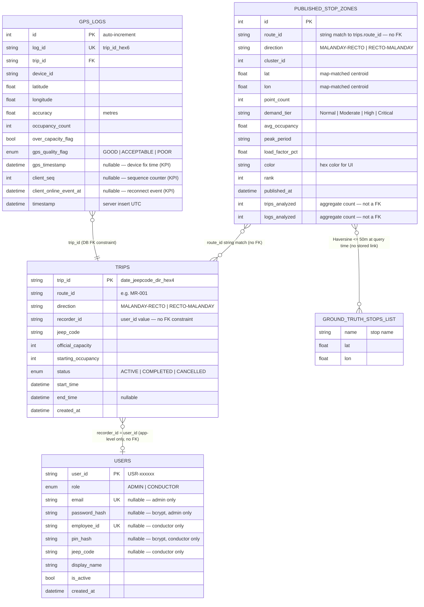

# Diagram 1: Entity-Relationship Diagram

## Verification Notes

| Claim | Verified Against | Result |
|---|---|---|
| `gps_logs.trip_id` is a FK | `app/models/gps_log.py:39` — `ForeignKey("trips.trip_id")` | ✅ Confirmed DB constraint |
| `trips.recorder_id` is FK to `users` | `app/models/trip.py:38` — bare `Column(String, nullable=False)`, no ForeignKey | ❌ App-level match only |
| `published_stop_zones.trips_analyzed` is a FK | `app/models/published_stop_zone.py:33-34` — `Column(Integer, ...)` aggregate counts | ❌ No FK — just counters |
| GROUND_TRUTH_STOPS is a DB table | `app/analytics/cluster_evaluation.py:45-116` | ❌ Hardcoded Python list (70 entries), no table |
| published_stop_zones ↔ GROUND_TRUTH link | `app/routes/stop_zone_routes.py:511-517` — `_nearest_gt()` uses Haversine ≤50m loop at request time | ✅ Computed, no stored link |
| API key enforcement | `app/main.py:62-75` — middleware checks `X-API-Key` header on all routes except `/docs`, `/openapi.json`, `/redoc` | ✅ Server-enforced |
| Role enforcement | All route handlers — no role check found in any handler | ❌ Client-side only (React guards) |

**Note for Chapter 3:** `recorder_id` stores the conductor's `user_id` value but is not a relational FK. The schema intentionally avoids cascading deletes — deleting a user account does not delete their trip history.

**Note for Chapter 3:** `GROUND_TRUTH_STOPS` is represented as a logical entity because it participates in the evaluation pipeline, but it has no corresponding database table. It is a constant Python list embedded in `cluster_evaluation.py` (70 field-verified stops, sourced from LTFRB franchise route documents).
