# Diagram 2: Use Case Diagram

```mermaid
flowchart TD
    %% Actors
    COND(["👤 Conductor"])
    ADMIN(["🔑 Admin"])
    PASS(["🚌 Passenger\n(public, no login)"])
    SYS(["⚙ System / ML Engine\n(internal — no direct actor)"])

    %% System boundary
    subgraph RutaSmart["RutaSmart System (all routes protected by X-API-Key header)"]
        direction TB

        subgraph AUTH["Authentication"]
            UC1["Login\n(employee_id + PIN)"]
            UC2["Login\n(email + password)"]
            UC3["Register Conductor Account\n(self-service, CONDUCTOR only)"]
        end

        subgraph CONDUCTOR_OPS["Conductor Operations\n(client-side role guard: RequireConductor)"]
            UC4["Start Trip\nPOST /trip/start-trip"]
            UC5["Log GPS Ping\nPOST /log/\n(auto every 3 s)"]
            UC6["End Trip\nPOST /trip/end-trip/{id}"]
            UC7["View Trip Summary\n(local — no API call)"]
            UC8["Export Trip CSV\nGET /trip/export/{id}"]
        end

        subgraph ADMIN_OPS["Admin Operations\n(client-side role guard: RequireAdmin)"]
            subgraph MAP["Map Dashboard"]
                UC9["View Map Dashboard\nGET /stop-zones/recommendations\nGET /admin/aggregate"]
            end
            subgraph TRIPS_ADMIN["Trip Management"]
                UC10["View All Trips\nGET /admin/trips"]
                UC11["Delete Trip\nDELETE /admin/trip/{id}"]
                UC12["Import Trip CSV\nPOST /admin/import"]
            end
            subgraph ZONES["Stop Zone Management"]
                UC13["Preview Stop Zones (dry run)\nGET /admin/route/{id}/preview-stops"]
                UC14["Publish Stop Zones\nPOST /admin/route/{id}/publish-stops"]
                UC15["View Stop Zone Recommendations\nGET /stop-zones/recommendations"]
            end
            subgraph RESEARCH["Research & ML"]
                UC16["View ML Model Status\nGET /api/clusters/ml-status"]
                UC17["Run Algorithm Comparison\nGET /analytics/merged/compare"]
                UC18["Run RF Classifier\nPOST /api/clusters/ml-random-forest"]
                UC19["Inspect Pipeline Audit\nGET /analytics/{id}/pipeline"]
                UC20["Run Sensitivity Analysis\nGET /analytics/{id}/sensitivity"]
                UC21["Evaluate Cluster Quality\nGET /analytics/{id}/evaluate"]
                UC22["Detect Route Overlap\nGET /analytics/overlap/{a}/{b}"]
                UC23["Run All Analytics\nGET /analytics/{id}/run-all"]
            end
            subgraph CONDUCTORS_ADMIN["Conductor Management"]
                UC24["View Conductors\nGET /auth/conductors"]
            end
        end

        subgraph PUBLIC_OPS["Passenger / Public (no login required, API key still enforced)"]
            UC25["View Live Jeep Occupancy\n(polled every 5 s)"]
            UC26["View Published Stop Zones on Map\nGET /public/route/{id}/stop-zones"]
            UC27["View Route Path\nGET /public/route/{id}/path"]
        end

        subgraph SYS_OPS["Internal System Functions (triggered by above actions, not directly by actors)"]
            SYS1["GPS Quality Classification\n(GOOD ≤20m / ACCEPTABLE ≤50m / POOR >50m)\ntriggered by: POST /log/"]
            SYS2["DBSCAN Stop Cluster Detection\n(ε=50m, minPts=5 for analytics;\nε=30m, minPts=20 for publish)\ntriggered by: analytics endpoints + publish"]
            SYS3["Kalman Filter Smoothing\ntriggered by: /dbscan-kalman, /merged/compare"]
            SYS4["Weighted DBSCAN (W-DBSCAN)\ntriggered by: /wdbscan, /merged/compare"]
            SYS5["Map Matching — match_to_corridor()\ntriggered by: publish-stops only"]
            SYS6["Random Forest Classifier\ntriggered by: /ml-random-forest (Admin)"]
            SYS7["Rule-Based Recommendation Engine\ntriggered by: /stop-zones/recommendations"]
            SYS8["Silhouette + Davies-Bouldin + GT Evaluation\ntriggered by: /evaluate, /merged/compare"]
        end
    end

    %% Actor → Use Case edges
    COND --> UC1
    COND --> UC4
    COND --> UC5
    COND --> UC6
    COND --> UC7
    COND --> UC8
    COND --> UC3

    ADMIN --> UC2
    ADMIN --> UC9
    ADMIN --> UC10
    ADMIN --> UC11
    ADMIN --> UC12
    ADMIN --> UC13
    ADMIN --> UC14
    ADMIN --> UC15
    ADMIN --> UC16
    ADMIN --> UC17
    ADMIN --> UC18
    ADMIN --> UC19
    ADMIN --> UC20
    ADMIN --> UC21
    ADMIN --> UC22
    ADMIN --> UC23
    ADMIN --> UC24

    PASS --> UC25
    PASS --> UC26
    PASS --> UC27

    %% System triggers
    UC5  -.->|triggers| SYS1
    UC14 -.->|triggers| SYS2
    UC14 -.->|triggers| SYS5
    UC23 -.->|triggers| SYS2
    UC17 -.->|triggers| SYS2
    UC17 -.->|triggers| SYS3
    UC17 -.->|triggers| SYS4
    UC17 -.->|triggers| SYS8
    UC18 -.->|triggers| SYS6
    UC15 -.->|triggers| SYS7
    UC21 -.->|triggers| SYS8
```

## Verification Notes

| Claim | Verified Against | Result |
|---|---|---|
| Role enforcement is server-side | All route handlers in `app/routes/` — no `Depends(get_current_user)` or role check found | ❌ Client-side only — React `RequireAdmin` / `RequireConductor` guards in `App.jsx` |
| API key enforced server-side | `app/main.py:62-75` — middleware rejects requests without `X-API-Key` header | ✅ All routes except `/docs`, `/openapi.json`, `/redoc` |
| ADMIN signs in with email+password | `app/routes/auth_routes.py:48-76` | ✅ |
| CONDUCTOR signs in with employee_id+PIN | `app/routes/auth_routes.py:80-111` | ✅ |
| GPS logging is automatic (not manual per-ping) | `rutas-frontend/src/pages/Recording.jsx:282-321` — `setInterval(..., 3000)` | ✅ 3-second interval |
| Trip end triggers analytics automatically | `app/routes/trip_routes.py:80-102` — only sets `status=COMPLETED` and `end_time` | ❌ NO automatic analytics — separate manual step |
| Passenger requires no login | `app/main.py` + `App.jsx` — `/public/*` routes have no auth guard | ✅ Public, API key only |
| Token format | `app/routes/auth_routes.py:41-43` — `base64(user_id:role:display_name:timestamp)` | ⚠️ Prototype token, not JWT — no server-side expiry |

**Note for Chapter 3:** The system does not implement server-side authorization beyond the shared API key. All role-based access control (CONDUCTOR vs ADMIN) is enforced in the React frontend via route guards. This is a thesis-prototype design decision; production deployment would require JWT with role claims verified server-side.
