# Diagram 3: Trip Lifecycle Sequence Diagram

```mermaid
sequenceDiagram
    actor C as Conductor PWA
    participant B as Backend (FastAPI / Railway)
    participant DB as PostgreSQL
    actor A as Admin Dashboard

    %% ── 1. Conductor Login ──────────────────────────────────────────────────
    rect rgb(20, 40, 70)
        Note over C,DB: 1 — Conductor Login
        C->>B: POST /auth/login/conductor<br/>{employee_id, pin}
        B->>DB: SELECT users WHERE employee_id = ? AND role = CONDUCTOR
        DB-->>B: User row
        B->>B: bcrypt verify PIN
        B-->>C: {token: base64(user_id:CONDUCTOR:name:ts),<br/>role, display_name, jeep_code}
        Note over C: Token stored in localStorage<br/>Sent as X-API-Key equivalent header on all subsequent calls<br/>(Note: prototype token — no JWT expiry)
    end

    %% ── 2. Start Trip ───────────────────────────────────────────────────────
    rect rgb(20, 55, 40)
        Note over C,DB: 2 — Start Trip
        C->>B: POST /trip/start-trip<br/>{route_id, direction, recorder_id,<br/>jeep_code, official_capacity, starting_occupancy}
        B->>DB: Check: no ACTIVE trip for this jeep_code
        B->>DB: INSERT trips (status=ACTIVE)
        DB-->>B: New trip row
        B-->>C: {trip_id: "date_jeepcode_dir_hex4", start_time}
    end

    %% ── 3. GPS Logging Loop (3 s interval) ──────────────────────────────────
    rect rgb(50, 30, 70)
        Note over C,DB: 3 — GPS Logging (auto every 3 s while trip ACTIVE)
        loop Every 3 000 ms (setInterval in Recording.jsx)
            C->>B: POST /log/<br/>{trip_id, latitude, longitude, accuracy,<br/>occupancy_count, device_id,<br/>gps_timestamp, client_seq, client_online_event_at}
            B->>B: Corridor bounds check (14.55–14.75°N, 120.95–121.05°E)<br/>Out-of-corridor → forced POOR regardless of accuracy
            B->>B: GPS quality classification:<br/>accuracy ≤ 20m → GOOD<br/>accuracy ≤ 50m → ACCEPTABLE<br/>accuracy > 50m → POOR
            B->>DB: INSERT gps_logs (gps_quality_flag set server-side)
            B-->>C: {log_id, gps_quality_flag, timestamp}
        end
    end

    %% ── 4. End Trip ──────────────────────────────────────────────────────────
    rect rgb(70, 40, 20)
        Note over C,DB: 4 — End Trip
        C->>B: POST /trip/end-trip/{trip_id}
        B->>DB: UPDATE trips SET status=COMPLETED, end_time=NOW()
        DB-->>B: Updated row
        B-->>C: {message: "Trip completed", trip_id, end_time}
        Note over C,B: ⚠️ Trip end does NOT trigger analytics or DBSCAN.<br/>No background job runs. GPS logs sit in DB unprocessed.
    end

    %% ── 5. Admin: Manual Analytics (separate step) ───────────────────────────
    rect rgb(20, 55, 70)
        Note over A,DB: 5 — Admin Manually Triggers Analytics (separate step, any time after trip COMPLETED)
        A->>B: GET /analytics/{trip_id}/run-all<br/>?eps_m=50&min_samples=5
        B->>DB: SELECT gps_logs WHERE trip_id = ? ORDER BY timestamp
        DB-->>B: All logs
        B->>B: Filter POOR logs (quality_flag = POOR excluded from clustering)<br/>Run DBSCAN (ε=50m, minPts=5) on GOOD+ACCEPTABLE only<br/>Velocity filter → TRUE_STOP / CREEPING_QUEUE / MOVING<br/>Compute load factor, demand tiers, time distribution
        B-->>A: {gps_quality, dbscan{clusters[]}, load_factor, demand, time_dist}
        Note over A,B: Analytics results are computed on demand.<br/>They are NOT stored in the database.<br/>Each call to /run-all reruns the full pipeline.
    end

    %% ── 6. Admin: Publish Stop Zones ─────────────────────────────────────────
    rect rgb(60, 20, 60)
        Note over A,DB: 6 — Admin Publishes Stop Zones (explicit HITL action)
        A->>B: POST /admin/route/MR-001/publish-stops<br/>?direction=MALANDAY-RECTO
        B->>DB: SELECT all COMPLETED trips WHERE route_id=MR-001 AND direction=MALANDAY-RECTO
        DB-->>B: N trips
        B->>DB: SELECT gps_logs WHERE quality IN (GOOD, ACCEPTABLE) for each trip
        DB-->>B: Pooled GPS points from all trips
        B->>B: Run DBSCAN (ε=30m, minPts=20) on pooled points<br/>Filter to TRUE_STOP clusters only<br/>Run match_to_corridor() on each centroid → snapped lat/lon
        B->>DB: DELETE FROM published_stop_zones WHERE route_id=MR-001 AND direction=MALANDAY-RECTO
        B->>DB: INSERT published_stop_zones (snapped centroids, demand tiers,<br/>trips_analyzed=N, logs_analyzed=total_points)
        DB-->>B: Committed
        B-->>A: {published: true, stop_zones: K, trips_analyzed: N, logs_analyzed: M}
        Note over A,B: Publish is atomic per direction.<br/>RECTO-MALANDAY zones are unaffected when MALANDAY-RECTO is published.
    end

    %% ── 7. Admin Map Dashboard Auto-Load ─────────────────────────────────────
    rect rgb(20, 60, 60)
        Note over A,DB: 7 — Admin Map Dashboard (auto-loads on mount / direction change)
        A->>B: GET /stop-zones/recommendations?route_id=MR-001&direction=MALANDAY-RECTO
        B->>DB: SELECT published_stop_zones WHERE route_id=MR-001 AND direction=...
        DB-->>B: Published zones
        B->>B: For each zone: compute Haversine to GROUND_TRUTH_STOPS → nearest_gt_name<br/>Compute trip-day coverage → confidence (High/Medium/Low)<br/>Apply 6-rule recommendation engine
        B-->>A: {zones[{name, demand_tier, confidence, recommendation, ...}]}
        A->>B: GET /admin/aggregate
        B-->>A: Aggregate KPIs
        Note over A: Map renders automatically.<br/>After step 6 (publish), Admin must change direction<br/>or reload page to see newly published zones —<br/>AdminMap does not poll for updates.
    end
```

## Verification Notes

| Assumed Behaviour | Actual Behaviour (Verified) | Source |
|---|---|---|
| Token is a JWT | Base64-encoded string `user_id:role:display_name:timestamp` — no signature, no expiry | `auth_routes.py:41-43` |
| GPS logs sent every 5s | **3 seconds** — `setInterval(..., 3000)` | `Recording.jsx:282,321` |
| Bounding box rejects out-of-corridor logs | **Soft flag only** — out-of-corridor logs are classified POOR and stored; not rejected | `gps_routes.py:40-65` |
| Trip end triggers DBSCAN / analytics | **No** — end-trip only sets `status=COMPLETED` and `end_time`. Zero downstream computation | `trip_routes.py:80-102` |
| Analytics results are stored | **No** — all `/analytics/` endpoints compute on demand and return results without writing to DB | All analytics route handlers |
| Publish uses ε=50m (same as research) | **No** — publish uses ε=30m, minPts=20 (tighter, for pooled multi-trip data) | `stop_zone_routes.py:129` |
| AdminMap polls after publish | **No** — `useEffect` runs on mount and on `direction` state change only. New publish is visible after direction toggle or page reload | `AdminMap.jsx:45-58` |
| GROUND_TRUTH_STOPS matching is stored | **No** — Haversine computed at request time in `_nearest_gt()` loop | `stop_zone_routes.py:511-517` |
