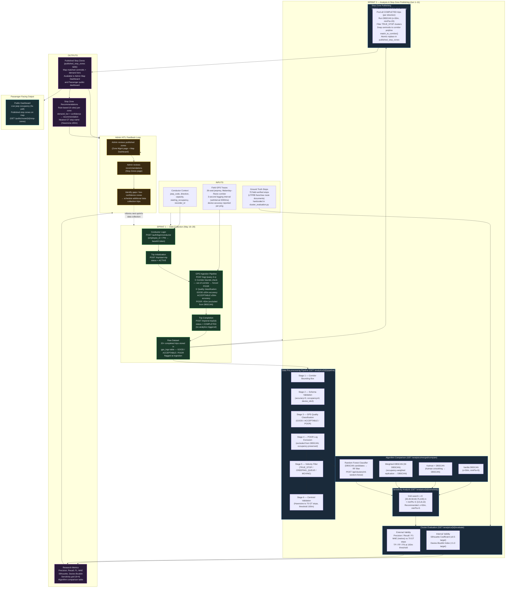

# Diagram 4: Conceptual Framework

## Verification Notes

| Framework Element | Source Verified | Notes |
|---|---|---|
| GPS logging interval (3s) | `Recording.jsx:321` | Confirmed `setInterval(..., 3000)` |
| Pipeline stages 1–6 | `analytics_routes.py:436-572` | Stage sequence and exclusion logic confirmed |
| POOR exclusion preserves occupancy for load factor | `analytics_routes.py:540-544` | Explicitly stated in rationale field |
| Velocity filter thresholds | `algorithms.py` (referenced) | TRUE_STOP <0.3m/s, CREEPING_QUEUE 0.3–1.0m/s, MOVING >1.0m/s |
| Sensitivity grid dimensions | `analytics_routes.py:836-879` | ε=[30,40,50,60,75,100], minPts=[3,5,8,10] |
| Publish DBSCAN uses ε=30m, minPts=20 (not ε=50m) | `stop_zone_routes.py:129` | Different params from research DBSCAN — pooled multi-trip data warrants tighter clustering |
| GT evaluation uses 70 stops | `cluster_evaluation.py:45-116` | Confirmed 70-entry list; FN denominator = 70 |
| Recommendation engine is rule-based (not ML) | `stop_zone_routes.py:519-530` | 6-rule function `_recommend(tier, conf, days)` |
| Analytics results not stored | All analytics route handlers | Computed on demand; DB holds only raw logs + published zones |
| Trip end does not trigger analytics | `trip_routes.py:80-102` | Only sets status=COMPLETED — no downstream computation |
| Passenger polling interval | `PublicDashboard.jsx:8` | `POLL_MS = 5000` confirmed |

**Note on Sprint framing:** The Sprint 1 / Sprint 2 boundary reflects the thesis project timeline. The system architecture does not enforce this split — both phases use the same API. The framing is used here to distinguish the data collection objective (Sprint 1: raw GPS accumulation) from the analysis objective (Sprint 2: clustering, evaluation, publishing).

**Note on feedback loop:** The Admin HITL (Human-in-the-Loop) step is the `POST /admin/route/{id}/publish-stops` action. There is no automated re-publish or scheduled job — each publication requires an explicit Admin decision after reviewing the dry-run preview (`GET /admin/route/{id}/preview-stops`).
